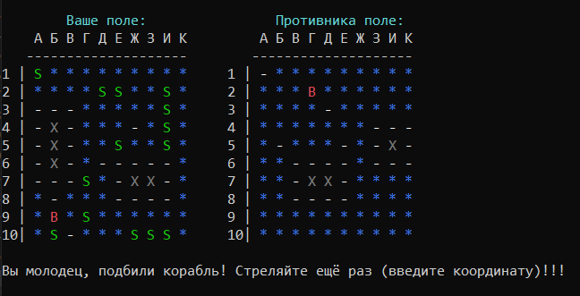
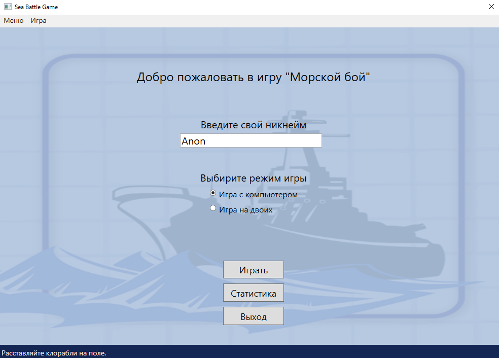
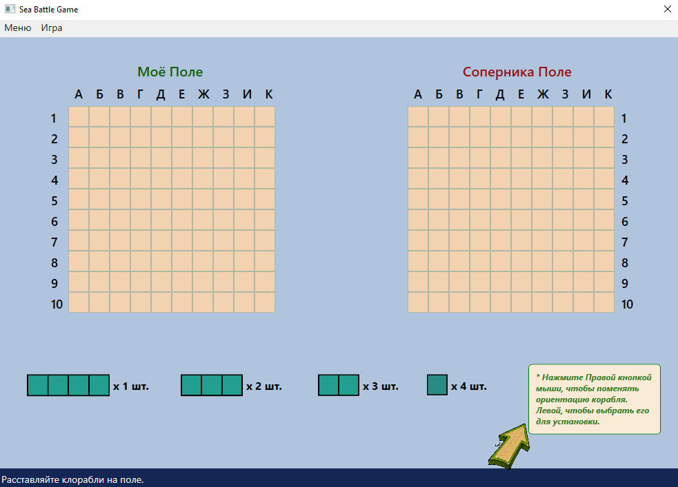
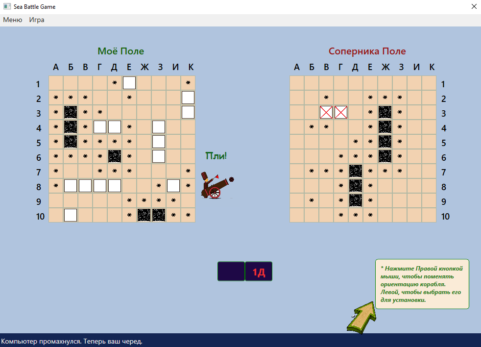

# SeaBattleProject
## Классический морской бой*.
Репозиторий содержит 2 проекта: **SeaBattleApp** - консольный вариант игры и **SeaBattleGUI** - вариант с использованием технологии WPF для отображения графики.\
Основные функциональные возможности:\
- Выбор режима игры: с компютером или на двоих по локальной сети
- Валидация всех вводимых данных пользователем
- Отображение игровых полей в цветном виде(работает только для ОС Windows)
- Событийная модель для вывода сообщений игроку и обработки изменений состояния игрового поля
- Умный алгоритм работы компьютерного игрока
- Отслеживание и Сохранение статистики игры в папке Документы пользователя (для ОС Windows)
- Игра по сети предоставляет ip адрес текущей сети для обоих игроков, после чего можно совершать игру с другом (используется строгая синхронизация с блокировками консоли для SeaBattleApp)\
 \
\
\
\
\
*Правила размещения кораблей (флота):\
Игровое поле — обычно квадрат 10×10 у каждого игрока, на котором размещается флот кораблей. Горизонтали обычно нумеруются сверху вниз, а вертикали помечаются буквами слева направо. При этом используются буквы русского алфавита от «А» до «К» (буквы «Ё» и «Й» обычно пропускаются).
Размещаются:\
\
1 корабль — ряд из 4 клеток («четырёхпалубный»; линкор)\
2 корабля — ряд из 3 клеток («трёхпалубные»; крейсера)\
3 корабля — ряд из 2 клеток («двухпалубные»; эсминцы)\
4 корабля — 1 клетка («однопалубные»; торпедные катера)\
При размещении корабли не могут касаться друг друга сторонами и углами.\
Рядом со «своим» полем чертится «чужое» такого же размера, только пустое. Это участок моря, где плавают корабли противника.\
При попадании в корабль противника — на чужом поле ставится крестик, при холостом выстреле — точка. Попавший стреляет ещё раз.\
Самыми уязвимыми являются линкор и торпедный катер: первый из-за крупных размеров, в связи с чем его сравнительно легко найти, а второй из-за того, что топится с одного удара, хотя его найти достаточно сложно.\

